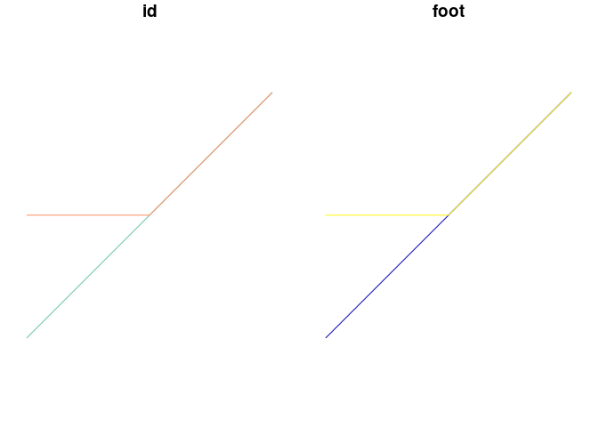

The aim of this repo is to test functionality in the `overline` function
and try to speed-it up.

``` r
if(!file.exists("routes.geojson")) {
  routes = pct::get_pct_routes_fast("isle-of-wight")
  routes = routes %>% 
    slice(1:1000)
  sf::write_sf(routes, "routes.geojson", delete_dsn = TRUE)
}
```

``` r
routes = geojsonsf::geojson_sf("routes.geojson")
nrow(routes)
```

    [1] 1000

``` r
res = bench::mark(time_unit = "s",
  original = {stplanr::overline(routes, attrib = "foot")}
)
```

    2023-08-15 14:50:48.486012 constructing segments

    2023-08-15 14:50:50.00322 building geometry

    2023-08-15 14:50:50.38806 simplifying geometry

    2023-08-15 14:50:50.388445 aggregating flows

    2023-08-15 14:50:50.687019 rejoining segments into linestrings

    2023-08-15 14:50:56.648005 constructing segments

    2023-08-15 14:50:58.02719 building geometry

    2023-08-15 14:50:58.359577 simplifying geometry

    2023-08-15 14:50:58.359966 aggregating flows

    2023-08-15 14:50:58.583149 rejoining segments into linestrings

    Warning: Some expressions had a GC in every iteration; so filtering is
    disabled.

``` r
res |>
  dplyr::select(expression, median, mem_alloc) |>
  mutate(routes_per_second = nrow(routes) / median) |>
  knitr::kable()
```

| expression |   median | mem_alloc | routes_per_second |
|:-----------|---------:|----------:|------------------:|
| original   | 2.042045 |     229MB |          489.7051 |

<!-- <details> -->

A breakdown of the `overline` function is as follows:

``` r
sl = sf::st_sf(
  data.frame(
    id = c("a", "b"),
    foot = c(1, 2),
    geometry = sf::st_sfc(
      sf::st_linestring(
        matrix(
          c(0, 0, 1, 1, 2, 2),
          ncol = 2,
          byrow = TRUE
        )
      ),
      sf::st_linestring(
        matrix(
          c(0, 1, 1, 1, 2, 2),
          ncol = 2,
          byrow = TRUE
        )
      )
    )
  )
)
plot(sl)
```



`sfheaders` is x faster:

``` r
bench::mark(check = FALSE,
  sf = {c1 = sf::st_coordinates(sl)},
  sfheaders = {c1_new = sfheaders::sf_to_df(sl)}
)
```

    # A tibble: 2 × 6
      expression      min   median `itr/sec` mem_alloc `gc/sec`
      <bch:expr> <bch:tm> <bch:tm>     <dbl> <bch:byt>    <dbl>
    1 sf           46.6µs   47.9µs    20724.      384B     6.37
    2 sfheaders    19.5µs   20.2µs    49211.    85.2KB     4.92

``` r
waldo::compare(c1, c1_new)
```

    `old` is a double vector (0, 1, 2, 0, 1, ...)
    `new` is an S3 object of class <data.frame>, a list

``` r
c1_new
```

      sfg_id linestring_id x y
    1      1             1 0 0
    2      1             1 1 1
    3      1             1 2 2
    4      2             2 0 1
    5      2             2 1 1
    6      2             2 2 2

``` r
bench::mark(check = FALSE,
  sf = {l1 = c1[, 3]},
  sfheaders = {l1_new = c1_new$sfg_id}
)
```

    # A tibble: 2 × 6
      expression      min   median `itr/sec` mem_alloc `gc/sec`
      <bch:expr> <bch:tm> <bch:tm>     <dbl> <bch:byt>    <dbl>
    1 sf            962ns    992ns   952556.        0B      0  
    2 sfheaders     964ns    985ns   966191.        0B     96.6

``` r
l1_new
```

    [1] 1 1 1 2 2 2

`kit` is 2x faster:

``` r
l1_start = duplicated(l1) # find the break points between lines
l1_start = c(l1_start[2:length(l1)], FALSE)
bench::mark(check = FALSE,
  old = {l1_start = c(duplicated(l1)[2:length(l1)], FALSE)},
  new = {l1_start_new = c(!kit::fduplicated(l1_new))}
)
```

    # A tibble: 2 × 6
      expression      min   median `itr/sec` mem_alloc `gc/sec`
      <bch:expr> <bch:tm> <bch:tm>     <dbl> <bch:byt>    <dbl>
    1 old           4.5µs   4.69µs   210815.        0B        0
    2 new          1.74µs   1.82µs   540611.      31KB        0

``` r
get_start_end = function(l1) {
  dups = kit::fduplicated(l1)
  start_points = !dups
  end_points = c(start_points[-1], TRUE)
  list(start_points = start_points, end_points = end_points)
}
get_start_end(l1_new)
```

    $start_points
    [1]  TRUE FALSE FALSE  TRUE FALSE FALSE

    $end_points
    [1] FALSE FALSE  TRUE FALSE FALSE  TRUE

``` r
c1
```

         X Y L1
    [1,] 0 0  1
    [2,] 1 1  1
    [3,] 2 2  1
    [4,] 0 1  2
    [5,] 1 1  2
    [6,] 2 2  2

``` r
c2 <- c1[2:nrow(c1), 1:2] # Create new coords offset by one row
c2 <- rbind(c2, c(NA, NA))
c2[nrow(c1), ] <- c(NA, NA)
c2[!l1_start, 1] <- NA
c2[!l1_start, 2] <- NA
c3 <- cbind(c1, c2)
c3
```

         X Y L1  X  Y
    [1,] 0 0  1  1  1
    [2,] 1 1  1  2  2
    [3,] 2 2  1 NA NA
    [4,] 0 1  2  1  1
    [5,] 1 1  2  2  2
    [6,] 2 2  2 NA NA

``` r
coordinate_offset_old = function(c1, l1_start) {
  c2 <- c1[2:nrow(c1), 1:2] # Create new coords offset by one row
  c2 <- rbind(c2, c(NA, NA))
  c2[nrow(c1), ] <- c(NA, NA)
  c2[!l1_start, 1] <- NA
  c2[!l1_start, 2] <- NA
  c3 <- cbind(c1[, c("L1", "X", "Y")], c2)
  c3 <- c3[!is.na(c3[, 4]), ]
  c3
}
coordinate_offset = function(c1) {
  se = get_start_end(c1[, "L1"])
  coords_exploded = cbind(
    c1[!se$end_points, c("L1", "X", "Y")],
    c1[!se$start_points, 1:2]
    )
  colnames(coords_exploded) = c("L1", "X", "Y", "X2", "Y2")
}
coordinate_offset(c1)
```

``` r
bench::mark(check = FALSE,
  old = {c3 = coordinate_offset_old(c1, l1_start)},
  new = {c3_new = coordinate_offset(c1)}
)
```

    # A tibble: 2 × 6
      expression      min   median `itr/sec` mem_alloc `gc/sec`
      <bch:expr> <bch:tm> <bch:tm>     <dbl> <bch:byt>    <dbl>
    1 old          11.7µs   12.3µs    80087.   111.5KB     8.01
    2 new            12µs   12.6µs    77652.    35.9KB     7.77

``` r
waldo::compare(c3, c3_new)
```

    `old` is a double vector (1, 1, 2, 2, 0, ...)
    `new` is a character vector ('L1', 'X', 'Y', 'X2', 'Y2')

``` r
sl_df = sf::st_drop_geometry(sl)
se = get_start_end(c1[, "L1"])
sl_df_expanded = sl_df[c3[, "L1"], ]
```

``` r
knitr::opts_chunk$set(
  eval = FALSE
)  
```

``` r
sl_wide <- cbind(c3_new, sl_df_expanded)
bench::mark(check = FALSE,
  dplyr = dplyr::group_by_at(sl_wide, c("1", "2", "3", "4")) |>
    summarise_if(is.numeric, sum),
  collapse = collapse::fgroup_by(sl_wide, c("1", "2", "3", "4")) |>
    collapse::fsummarise(res = mean(foot))
)
sls = collapse::fgroup_by(sl_wide, c("1", "2", "3", "4")) |>
  collapse::fsummarise(foot = sum(foot))
attrib <- names(sls)[5:ncol(sls)]
coords <- as.matrix(sls[, 1:4])
sl_values <- sls[, -c(1:4)]
sl_crs = sf::st_crs(sl)
```

``` r
bench::mark(check = FALSE,
  sf = {geom <- sf::st_as_sfc(
        pbapply::pblapply(1:nrow(coords), function(y) {
          sf::st_linestring(matrix(coords[y, ], ncol = 2, byrow = T))
        }),
      crs = sl_crs
    )},
  sfh = {geomh <- 
        pbapply::pblapply(1:nrow(coords), function(y) {
          sfheaders::sfc_linestring(matrix(coords[y, ], ncol = 2, byrow = T))
        })}
    )

plot(geom)
```

``` r
            lapply(sl, function(y) {
              y <- dplyr::group_by_at(y, attrib)
              y <- dplyr::summarise(y, do_union = FALSE, .groups = "drop")
            })
```

``` r
    # Recombine into fewer lines
    if (simplify) {
      if (!quiet) {
        message(paste0(Sys.time(), " simplifying geometry"))
      }
      if (nrow(sl) > regionalise) {
        message(paste0("large data detected, using regionalisation, nrow = ", nrow(sl)))
        suppressWarnings(cents <- sf::st_centroid(sl))
        # Fix for https://github.com/r-spatial/sf/issues/1777
        if(sf::st_is_longlat(cents)){
          bbox <- sf::st_bbox(cents)
          bbox[1] <- bbox[1] - abs(bbox[1] * 0.001)
          bbox[2] <- bbox[2] - abs(bbox[2] * 0.001)
          bbox[3] <- bbox[3] + abs(bbox[3] * 0.001)
          bbox[4] <- bbox[4] + abs(bbox[4] * 0.001)
          bbox <- sf::st_as_sfc(bbox)
          grid <- sf::st_make_grid(bbox, what = "polygons")
        } else {
          grid <- sf::st_make_grid(cents, what = "polygons")
        }

        suppressWarnings(inter <- unlist(lapply(sf::st_intersects(cents, grid), `[[`, 1)))
        sl$grid <- inter
        rm(cents, grid, inter)
        # split into a list of df by grid
        sl <- dplyr::group_split(sl, grid)
        message(paste0(Sys.time(), " regionalisation complete, aggregating flows"))
        if (ncores > 1) {
          cl <- parallel::makeCluster(ncores)
          parallel::clusterExport(
            cl = cl,
            varlist = c("attrib"),
            envir = environment()
          )
          parallel::clusterEvalQ(cl, {
            library(sf)
            # library(dplyr)
          })
          overlined_simple <- if (requireNamespace("pbapply", quietly = TRUE)) {
            pbapply::pblapply(sl, function(y) {
              y <- dplyr::group_by_at(y, attrib)
              y <- dplyr::summarise(y, do_union = FALSE, .groups = "drop")
            }, cl = cl)
          } else {
            lapply(sl, function(y) {
              y <- dplyr::group_by_at(y, attrib)
              y <- dplyr::summarise(y, do_union = FALSE, .groups = "drop")
            })
          }

          parallel::stopCluster(cl)
          rm(cl)
        } else {
          overlined_simple <- if (requireNamespace("pbapply", quietly = TRUE)) {
            pbapply::pblapply(sl, function(y) {
              y <- dplyr::group_by_at(y, attrib)
              y <- dplyr::summarise(y, do_union = FALSE, .groups = "drop")
            })
          } else {
            lapply(sl, function(y) {
              y <- dplyr::group_by_at(y, attrib)
              y <- dplyr::summarise(y, do_union = FALSE, .groups = "drop")
            })
          }
        }
        rm(sl)
        overlined_simple <- data.table::rbindlist(overlined_simple)
        overlined_simple <- sf::st_sf(overlined_simple)
        overlined_simple <- overlined_simple[seq_len(nrow(overlined_simple)), ]
      } else {
        if (!quiet) {
          message(paste0(Sys.time(), " aggregating flows"))
        }
        overlined_simple <- dplyr::group_by_at(sl, attrib)
        overlined_simple <- dplyr::summarise(overlined_simple, do_union = FALSE, .groups = "drop")
        rm(sl)
      }

      overlined_simple <- as.data.frame(overlined_simple)
      overlined_simple <- sf::st_sf(overlined_simple)

      # Separate our the linestrings and the mulilinestrings
      if (!quiet) {
        message(paste0(Sys.time(), " rejoining segments into linestrings"))
      }
      overlined_simple <- sf::st_line_merge(overlined_simple)
      geom_types <- sf::st_geometry_type(overlined_simple)
      overlined_simple_l <- overlined_simple[geom_types == "LINESTRING", ]
      overlined_simple_ml <- overlined_simple[geom_types == "MULTILINESTRING", ]
      suppressWarnings(overlined_simple_ml <-
        sf::st_cast(
          sf::st_cast(overlined_simple_ml, "MULTILINESTRING"),
          "LINESTRING"
        ))

      return(rbind(overlined_simple_l, overlined_simple_ml))
    } else {
      return(sl)
    }
```

Testing…

``` r
overline2 <-
  function(sl,
           attrib,
           ncores = 1,
           simplify = TRUE,
           regionalise = 1e9,
           quiet = ifelse(nrow(sl) < 1000, TRUE, FALSE),
           fun = sum) {
    browser()
    if(as.character(unique(sf::st_geometry_type(sl))) == "MULTILINESTRING") {
      message("Converting from MULTILINESTRING to LINESTRING")
      sl <- sf::st_cast(sl, "LINESTRING")
    }
    if (!"sfc_LINESTRING" %in% class(sf::st_geometry(sl))) {
      stop("Only LINESTRING is supported")
    }
    if (is(sl, "data.table")) {
      sl_df <- as.data.frame(sf::st_drop_geometry(sl))
      sl <- sf::st_sf(sl_df, geometry = sl$geometry)
    }
    if (any(c("1", "2", "3", "4", "grid") %in% attrib)) {
      stop("1, 2, 3, 4, grid are not a permitted column names, please rename that column")
    }
    sl <- sf::st_zm(sl)
    sl <- sl[, attrib]
    sl_crs <- sf::st_crs(sl)
    if (!quiet) {
      message(paste0(Sys.time(), " constructing segments"))
    }
    c1 <- sf::st_coordinates(sl)
    sf::st_geometry(sl) <- NULL
    l1 <- c1[, 3] # Get which line each point is part of
    c1 <- c1[, 1:2]
    l1_start <- duplicated(l1) # find the break points between lines
    l1_start <- c(l1_start[2:length(l1)], FALSE)
    c2 <- c1[2:nrow(c1), 1:2] # Create new coords offset by one row
    c2 <- rbind(c2, c(NA, NA))
    c2[nrow(c1), ] <- c(NA, NA)
    c2[!l1_start, 1] <- NA
    c2[!l1_start, 2] <- NA
    c3 <- cbind(c1, c2) # make new matrix of start and end coords
    rm(c1, c2)
    c3 <- c3[!is.na(c3[, 3]), ]
    sl <- sl[l1[l1_start], , drop = FALSE] # repeate attributes
    rm(l1, l1_start)

    # if (!quiet) {
    #   message(paste0(Sys.time(), " transposing 'B to A' to 'A to B'"))
    # }
    attributes(c3)$dimnames <- NULL
    c3 <- t(apply(c3, MARGIN = 1, FUN = function(y) {
      if (y[1] != y[3]) {
        if (y[1] > y[3]) {
          c(y[3], y[4], y[1], y[2])
        } else {
          y
        }
      } else {
        if (y[2] > y[4]) {
          c(y[3], y[4], y[1], y[2])
        } else {
          y
        }
      }
    }))

    # if (!quiet) {
    #   message(paste0(Sys.time(), " removing duplicates"))
    # }
    sl <- cbind(c3, sl)
    rm(c3)

    # browser()
    # if(requireNamespace("data.table", quietly = TRUE)) {
    #   sl = data.table::data.table(sl)
    # }
    slg <- dplyr::group_by_at(sl, c("1", "2", "3", "4"))
    sls <- dplyr::ungroup(dplyr::summarise_all(slg, .funs = fun))
    attrib <- names(sls)[5:ncol(sls)]
    coords <- as.matrix(sls[, 1:4])
    sl <- sls[, -c(1:4)]

    # Make Geometry
    if (!quiet) {
      message(paste0(Sys.time(), " building geometry"))
    }
    sf::st_geometry(sl) <- sf::st_as_sfc(
      if (requireNamespace("pbapply", quietly = TRUE)) {
        pbapply::pblapply(1:nrow(coords), function(y) {
          sf::st_linestring(matrix(coords[y, ], ncol = 2, byrow = T))
        })
      } else {
        lapply(1:nrow(coords), function(y) {
          sf::st_linestring(matrix(coords[y, ], ncol = 2, byrow = T))
        })
      },
      crs = sl_crs
    )
    rm(coords)

    # Recombine into fewer lines
    if (simplify) {
      if (!quiet) {
        message(paste0(Sys.time(), " simplifying geometry"))
      }
      if (nrow(sl) > regionalise) {
        message(paste0("large data detected, using regionalisation, nrow = ", nrow(sl)))
        suppressWarnings(cents <- sf::st_centroid(sl))
        # Fix for https://github.com/r-spatial/sf/issues/1777
        if(sf::st_is_longlat(cents)){
          bbox <- sf::st_bbox(cents)
          bbox[1] <- bbox[1] - abs(bbox[1] * 0.001)
          bbox[2] <- bbox[2] - abs(bbox[2] * 0.001)
          bbox[3] <- bbox[3] + abs(bbox[3] * 0.001)
          bbox[4] <- bbox[4] + abs(bbox[4] * 0.001)
          bbox <- sf::st_as_sfc(bbox)
          grid <- sf::st_make_grid(bbox, what = "polygons")
        } else {
          grid <- sf::st_make_grid(cents, what = "polygons")
        }

        suppressWarnings(inter <- unlist(lapply(sf::st_intersects(cents, grid), `[[`, 1)))
        sl$grid <- inter
        rm(cents, grid, inter)
        # split into a list of df by grid
        sl <- dplyr::group_split(sl, grid)
        message(paste0(Sys.time(), " regionalisation complete, aggregating flows"))
        if (ncores > 1) {
          cl <- parallel::makeCluster(ncores)
          parallel::clusterExport(
            cl = cl,
            varlist = c("attrib"),
            envir = environment()
          )
          parallel::clusterEvalQ(cl, {
            library(sf)
            # library(dplyr)
          })
          overlined_simple <- if (requireNamespace("pbapply", quietly = TRUE)) {
            pbapply::pblapply(sl, function(y) {
              y <- dplyr::group_by_at(y, attrib)
              y <- dplyr::summarise(y, do_union = FALSE, .groups = "drop")
            }, cl = cl)
          } else {
            lapply(sl, function(y) {
              y <- dplyr::group_by_at(y, attrib)
              y <- dplyr::summarise(y, do_union = FALSE, .groups = "drop")
            })
          }

          parallel::stopCluster(cl)
          rm(cl)
        } else {
          overlined_simple <- if (requireNamespace("pbapply", quietly = TRUE)) {
            pbapply::pblapply(sl, function(y) {
              y <- dplyr::group_by_at(y, attrib)
              y <- dplyr::summarise(y, do_union = FALSE, .groups = "drop")
            })
          } else {
            lapply(sl, function(y) {
              y <- dplyr::group_by_at(y, attrib)
              y <- dplyr::summarise(y, do_union = FALSE, .groups = "drop")
            })
          }
        }
        rm(sl)
        overlined_simple <- data.table::rbindlist(overlined_simple)
        overlined_simple <- sf::st_sf(overlined_simple)
        overlined_simple <- overlined_simple[seq_len(nrow(overlined_simple)), ]
      } else {
        if (!quiet) {
          message(paste0(Sys.time(), " aggregating flows"))
        }
        overlined_simple <- dplyr::group_by_at(sl, attrib)
        overlined_simple <- dplyr::summarise(overlined_simple, do_union = FALSE, .groups = "drop")
        rm(sl)
      }

      overlined_simple <- as.data.frame(overlined_simple)
      overlined_simple <- sf::st_sf(overlined_simple)

      # Separate our the linestrings and the mulilinestrings
      if (!quiet) {
        message(paste0(Sys.time(), " rejoining segments into linestrings"))
      }
      overlined_simple <- sf::st_line_merge(overlined_simple)
      geom_types <- sf::st_geometry_type(overlined_simple)
      overlined_simple_l <- overlined_simple[geom_types == "LINESTRING", ]
      overlined_simple_ml <- overlined_simple[geom_types == "MULTILINESTRING", ]
      suppressWarnings(overlined_simple_ml <-
        sf::st_cast(
          sf::st_cast(overlined_simple_ml, "MULTILINESTRING"),
          "LINESTRING"
        ))

      return(rbind(overlined_simple_l, overlined_simple_ml))
    } else {
      return(sl)
    }
  }
```
